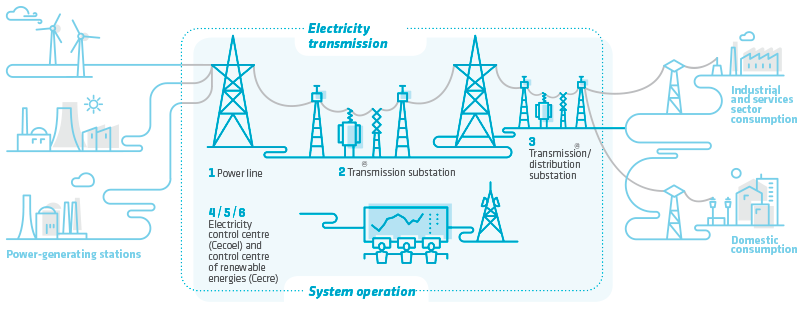
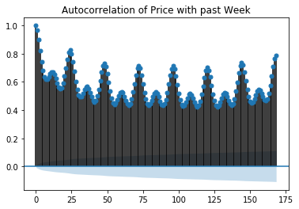

# Forecasting Day Ahead Electric Prices in Spain - Ongoing

**Acknowledgment:** This project was inspired by and the data was largely provided by [Nicholas Jhana](https://www.kaggle.com/nicholasjhana/energy-consumption-generation-prices-and-weather)

## Contents
- [Problem Statement](#Problem-Statement)
  - Overview of Wholesale Electric Markets
  - Spanish Electric Market
- [Repo Structure](#Repo-Structure)
- [Executive Summary](#Executive-Summary)
  - Data
  - EDA, Cleaning & Transformation
  - Models
  - Summary Evaluation
- [Current Best Model](#Current-Best-Model)
- [Future Work](#Future-Work)
  
## Problem Statement

Predict electricity prices in Spain for each hour of the upcoming day more accurately than estimates provided by the Spanish transmission agent and operator. 

Use information available during the 2pm-3pm window the previous day during which generators in Spain submit their bids.

**Overview of  Electric Markets** 
Electric markets are highly complex, however, if we stay at high level they are fairly simple to understand. Electric markets are generally defined but some sort of geographical boundary and have 3 main agents (names can vary):
- *Generators*: power plants, renewable plants, etc. that actually generate electricity
- *Transmission & System Operator (TSO)*: In charge of getting power from the generators to the consumers, ensuring that demand and supply match, manage the market for electricity
- *Consumers*: anyone and everyone who consumes electricity from the grid 

The diagram below (from [RED Electrica de Espana](https://www.ree.es/en/about-us/business-activities/electricity-business-in-Spain)) shows this general structure.

While there are numerous financial instruments built around these wholesale markets and intraday and futures trading most also have a day ahead auction, what this project focuses on. In these auctions generators bid the price that they are willing to produce energy for and how much for at various times of the day. The system operator then selects the cheapest bids up to the point where projected demand is met and all of the generators are paid that price for electricity the next day during said time slot. While this may make it seem as though a generators bid is not important, as all generators are paid the same price, if you are the price setting generator it hurts everyone's profits to bid too low. On the flip side, bidding too high can leave one out of the market and as such accurate forecast of price are important.

For more on wholesale electric markets please [publicpower.org](https://www.publicpower.org/policy/wholesale-electricity-markets-and-regional-transmission-organizations) and google to your hearts content. 

**Spanish Electric Market** 
The entirety of Spain operates in a single wholesale market and the TSO is [RED Electrica de Espana](https://www.ree.es/en/about-us/business-activities/electricity-business-in-Spain). They oversee a daily auction which concludes at 3pm local time and receive bids for all 24 hours of the next day. This daily auction is the basis for the project, with the goal being to predict electric prices with greater accuracy than the RED provided forecasts.

For more information on the spanish electric rules see this [link](./Research/market_rules_2019_non-binding_translation.pdf).

## Repo Structure
- [Code](./Code)
  - Jupyter Notebooks use the following naming conventions
    - 0x_xxx EDA
    - 1x_xxx Combining results of EDA and feature engineering
    - 2x_xxx Modeling
    - 3x_xxx Evaluating models
  - [Models](./Code/Models) contains saved versions of models
- [Data](./Data) 
  - [energy-consumption-generation-prices-and-weather](./Data/energy-consumption-generation-prices-and-weather) contains data from kaggle
  - [Crude Oil](./Data/Crude-Oil) contains scraped oil price data
  - [intermediary](./Data/intermediary) contains csv's created as part of EDA process
  - [Analysis](./Data/Analysis) contains csv's used for analysis and created post EDA
- [Research](./Research)
  - Contains relevant accademic papers
- [Visuals](./Visuals)
  - Contains relevant visuals created during analysis and found on the web

## Executive Sumary

**Data** 
The primary data set for this project was provide on [kaggle](https://www.kaggle.com/nicholasjhana/energy-consumption-generation-prices-and-weather) by Nicholas Jhana and contains 29 columns of electricity price & generation data for all of Spain for every hour from January 1, 2014 to December 31, 2018 (35064 unique hours of data). 

Additionally Nicholas provided actual weather data for the same time period for the 5 largest cities in Spain, which was not included due to it being actual rather than forecasted data. However, I hope to include either that data or source weather predictions for future iterations.

The final data included in the is daily crude oil prices in euros, scraped from [exchangerates.org.uk](https://www.exchangerates.org.uk/commodities/OIL-EUR-history.html). This data was gathered due to supplement the generation, load and price data as fuel burning sources are often the [price setters](https://www.businessjuice.co.uk/energy-guides/what-drives-the-price-of-electricity/) in electric markets.

**EDA & Cleaning** 
Minimal cleaning of data was required with a maximum of 19 missing data points out of 35064 for any variable used for modeling. The method used to fill any missing data was *linear interpolation*. This method was chosen due to the variable, time series nature of the data and the gaps in data being small. Thus, linear interpolation allowed us to connect the previous non-missing data point and the next non-missing data point. While this is not a perfect method and likely understates the variance of the underlying data it seemed to be superior to other potential methods and overall should not have a large effect on our results since there was very little missing data.

Interestingly, while the price data passed the ADfuller test for stationarity there was clear fluctations in prices & load on an hourly and daily basis. Weekends and late at night / early morning showed the lowest load and prices, with an interesting dip in the early afternoon that seems to correlate to the spanish siesta. Further the variation in median prices was much larger when looking hourly that daily.

 

We can see this correlation even more clearly when we look at an autocorrelation chart, which shows the correlation between prices and their past selves. The chart clearly shows that the correlation is highest at 24 hour (i.e. one day) intervals and that going back a full week provides higher correlation than 2-6 days.

*Transformation* 
The only transformation of data performed was to get all of our X and y variables onto the same row of the data frame in order to facilitate modeling. This was accomplished using the *shift* method and resulted in each day having a single row with the following data points:
- The actual, hourly electric prices for the next day (our target)
- The projected, hourly total load and wind generation for the next day (information available from the operator)
- The actual, hourly electric prices from the begining of the previous day up to and including the 2pm-3pm time slot (known previous prices)
- The projected, hourly prices for the current day from 3pm - midnight (results of previous days bids)
- The actual crude oil price for the current day

These transformations also got rid of all of our detailed information on generation from different sources. This is because that generation is determined based on the auction (with the exception of wind and solar which produce what they produce) and thus can't be known until the auction is completed and further the day ahead actually procedes and any spikes / dips in demand occur.

Additionally, given time constraints, weather projections have not been included in the analysis as of yet, but this is a near-term area of further iteration and improvement.

**Models** 
*Baseline & Evaluation Metrics* 
The baseline against which we compared our models was day ahead prices provided in the original data set. These prices were not particularly accurate, generally underestimating the actual price, with a correlation of 0.73 with the actual prices and the following scores on the 2 metrics we used for evaluation:
- RMSE: €13.25
- R-Squared: 0.13

*Models Tested & Hyperparameters Tuned* 
The models tested fell broadly into 3 groups: standard regressors, vector auto regressors and neural nets. Below is a summary of the various models within each group.

*Standard Regressors* 
A grouping of widely used regressors found in the sklearn library
- Linear Regression
- Elastic Net Regression
- K Nearest Neighbors Regression
- Random Forest
- AdaBoost
- Support Vector Regressor
  
*Vector Auto Regressors* 
A family of popular regressors that use past y variables to predict new ones simultaneously. Due to difficulties in incorporating new observations in predictions it is difficult to make a 1 to 1 comparison with other model types and full evaluation of these model types is a future project. Model types that will be considered.
- VAR
- VARMAX (VAR model that also includes exogeneous variables)

*Neural Networks* 
Three neural networks that are common in time series analysis were fit to the data. All models used dropouts to avoid overfitting and a single hidden layer after the network specific layer (i.e. convolutional layer(s) for a CNN)
- Recurrent Neural Network (RNN)
- Convolutional Neural Network (CNN)
- Long Short Term Memory (LSTM)

**Summary Evaluation**

**Summary Metrics** 
| **Model**        | **Baseline** | **Linear Regression** | **Elastic Net** | **KNN** | **Random Forest** | **AdaBoost** | **SVR** | **VAR** | **VARMAX** | **RNN** | **CNN** | **LTSM** |
|------------------|--------------|-----------------------|-----------------|---------|-------------------|--------------|---------|---------|------------|---------|---------|----------|
| *Test RMSE* | €13.25       | €5.99                 | €5.96           | €7.50   | €6.94             | €7.16        | €5.87   | €5.65   | *TBU*      | *TBU*   | €6.43   | €9.25    |
| *Test r2*   | 0.130        | 0.759                 | 0.762           | 0.623   | 0.677             | 0.657        | 0.769   | 0.786   | *TBU*      | *TBU*   | 0.723   | 0.427    |

From these metrics it is clear that the best 2 models are the VAR and SVR models but for future analysis it is worth looking further into the elastic net and cnn models as they also perform well and additional features / online learning may lead them to be comparable or better than our leaders. The linear regression was near identical to the elastic net but going forward we will focus on the elastic net as it is a linear regression but with tunable regularization so including both would be overkill. While the best elastic net had very little regularization it is possible that we will perform better with more as weather and other data is added to the model.

**Predictions by Hour** 
One of the peculiarities of this problem is that all 24 hours of next day prices must be predicted by the same deadline. This naturally leads to an imbalance of known data for predicting and potentially less certainty when predicting the later hours vs the early hours of the day.

In looking at the RMSE's by hour of the day we can see that this was not the case and on aggregate our models seemed to do a better job of predicting prices during times when electricity prices were highest.

When we look at our, previously identified, top 4 models we can see the interesting pattern that the VAR does very well predicting the early hours of the day before it's performance tails off, while the SVR is more steady and is the best performing later in the day.

This leads me to feel that the SVR is probably the best standalone model, despite it's worse score than the VAR, given that it's performance is more steady throughout the day. However, given the problem not requiring a particularly fast solution with the known, daily bid deadline there is no reason that we can't combine the predictions of the VAR for the first half of the day with the SVR for the second half of the day.

Further, the performance of the VAR leads me to believe that the VARMAX may perform very well once it is implemented.

## Current Best Model

The project is currently ongoing and none of the models so far perform at high enough level that I would call them production models. However, as the project currently stands our best model is a combination of the VAR and SVR models.  

By combining the predictions from the VAR for the first 12 hours of the day, when it performs best, and the SVR for the last 12 hours of the day we are able to get a clear boost in performance, as seen below:

| **Model**          | **Baseline** | **SVR** | **VAR** | **VAR-SVR** |
|--------------------|--------------|---------|---------|-------------|
| **Full Test RMSE** | €13.25       | €5.87   | €5.65   | €5.49       |
| **Full Test r2**   | 0.130        | 0.769   | 0.786   | 0.798       |

However, we are still off by a huge amount at times as seen by the distribution of errors and in order to have a truly usable model for this application further refinement will be needed.

## Future Work

There are numerous areas for future improvements to the models and project as a whole. These areas for improvement can be broadly broken down into 5 areas:
- Continued research
  - I am certainly not an expert on electric grids and factors for pricing, continued research into grids and modeling techniques will help improve predictions and analysis
- Model & feature improvements
  - Incorporate weather data & predictions
  - More information on fuel prices, futures contract pricing
  - Incorporate connected grids (Spain's grid is connected to all neighboring countries and more broadly through Europe)
  - Continued iteration and testing of hyperparameters for top models
- Online learning
  - Incorporate process so that the models are constantly learning from new data not just making predictions
  - Develop signal for when model performance slips
- Production code & app / website
  - Transform code from static jupyter notebooks to production code that can directly take information from APIs and other feeds to generate predictions
  - Show predictions in real time
- Real-time, medium-term and long-term forecasting
  - The current scope of the problem is centered around day ahead auctions but this is far from the only scenario in which electric price forecasting is useful
