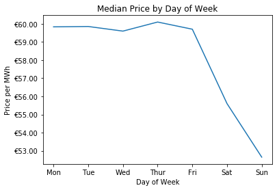

# Forecasting Day Ahead Electric Prices in Spain - Ongoing

## Contents
- [Problem Statement](#Problem-Statement)
- [Executive Summary](#Executive-Summary)
  - Data
  - EDA & Cleaning
  - Models
  - Summary Evaluation
- [Production Model](#Production-Model)
  - Model Discussion
  - Performance
- [Future Work](#Future-Work)
  - Features to add
  - Online Learning
  - App / Web display
  
## Problem Statement

Predict electricity prices in Spain for each hour of the upcoming day more accurately than estimates provided by the Spanish transmission agent and operator. 

Use information available during the 2pm-3pm window the previous day during which generators in Spain submit their bids.

## Executive Sumary

**Data** 
The primary data set for this project was provide on [kaggle](https://www.kaggle.com/nicholasjhana/energy-consumption-generation-prices-and-weather) by Nicholas Jhana and contains 29 columns of electricity price & generation data for all of Spain for every hour from January 1, 2014 to December 31, 2018 (35064 unique hours of data). 

Additionally Nicholas provided actual weather data for the same time period for the 5 largest cities in Spain, which was not included due to it being actual rather than forecasted data. However, I hope to include either that data or source weather predictions for future iterations.

The final data included in the is daily crude oil prices in euros, scraped from [exchangerates.org.uk](https://www.exchangerates.org.uk/commodities/OIL-EUR-history.html). This data was gathered due to supplement the generation, load and price data as fuel burning sources are often the [price setters](https://www.businessjuice.co.uk/energy-guides/what-drives-the-price-of-electricity/) in electric markets.

**EDA & Cleaning** 
Minimal cleaning of data was required with a maximum of 19 missing data points out of 35064 for any variable used for modeling. The method used to fill any missing data was *linear interpolation*. This method was chosen due to the variable, time series nature of the data and the gaps in data being small. Thus, linear interpolation allowed us to connect the previous non-missing data point and the next non-missing data point. While this is not a perfect method and likely understates the variance of the underlying data it seemed to be superior to other potential methods and overall should not have a large effect on our results since there was very little missing data.

Interestingly, while the price data passed the ADfuller test for stationarity there was clear fluctations in prices & load on an hourly and daily basis,

 

The only transformation of data performed was to get all of our X and y variables onto the same row of the data frame in order to facilitate modeling. This was accomplished using the *shift* method and resulted in each day having a single row with the following data points:
- The actual, hourly electric prices for the next day (our target)
- The projected, hourly total load and wind generation for the next day (information available from the operator)
- The actual, hourly electric prices from the begining of the previous day up to and including the 2pm-3pm time slot (known previous prices)
- The projected, hourly prices for the current day from 3pm - midnight (results of previous days bids)
- The actual crude oil price for the current day

These transformations also got rid of all of our detailed information on generation from different sources. This is because that generation is determined based on the auction (with the exception of wind and solar which produce what they produce) and thus can't be known until the auction is completed and further the day ahead actually procedes and any spikes / dips in demand occur.

Additionally, given time constraints, weather projections have not been included in the analysis as of yet, but this is a near-term area of further iteration and improvement.

**Models** 
*Baseline & Evaluation Metrics* 
The baseline against which we compared our models was day ahead prices provided in the original data set. These prices were not particularly accurate, generally underestimating the actual price, with a correlation of 0.73 with the actual prices and the following scores on the 2 metrics we used for evaluation:
- RMSE: €13.25
- R-Squared: 0.13

*Models Tested & Hyperparameters Tuned* 
The models tested fell broadly into 3 groups: standard regressors, vector auto regressors and neural nets. Below is a summary of the various models within each group.

*Standard Regressors* 
A grouping of widely used regressors found in the sklearn library
- Linear Regression
- Elastic Net Regression
- K Nearest Neighbors Regression
- Random Forest
- AdaBoost
- Support Vector Regressor
  
*Vector Auto Regressors* 
A family of popular regressors that use past y variables to predict new ones simultaneously. Due to difficulties in incorporating new observations in predictions it is difficult to make a 1 to 1 comparison with other model types and full evaluation of these model types is a future project. Model types that will be considered.
- VAR
- VARMAX (VAR model that also includes exogeneous variables)

*Neural Networks* 
Three neural networks that are common in time series analysis were fit to the data. All models used dropouts to avoid overfitting and a single hidden layer after the network specific layer (i.e. convolutional layer(s) for a CNN)
- Recurrent Neural Network (RNN)
- Convolutional Neural Network (CNN)
- Long Short Term Memory (LSTM)

**Summary Evaluation**

**Summary Metrics** 
| **Model**   | **Baseline** | **Linear Regression** | **Elastic Net** | **KNN** | **Random Forest** | **AdaBoost** | **SVR** | **VAR** | **VARMAX** | **RNN** | **CNN** | **LTSM** |
|-------------|--------------|-----------------------|-----------------|---------|-------------------|--------------|---------|---------|------------|---------|---------|----------|
| *Test RMSE* | €13.25       | €5.98                 | €5.94           | €7.47   | €6.89             | €7.12        | €5.86   | *TBU*   | *TBU*      | *TBU*   | €6.41   | €9.20    |
| *Train r2*  | *NA*         | 0.844                 | 0.843           | 0.753   | 0.966             | 0.811        | 0.830   | *TBU*   | *TBU*      | *TBU*   | 0.779   | 0.501    |
| *Test r2*   | 0.130        | 0.699                 | 0.703           | 0.543   | 0.610             | 0.579        | 0.713   | *TBU*   | *TBU*      | *TBU*   | 0.658   | 0.309    |

*Note*: Metrics besides baseline are the mean value for said metrics that were originally calculated for each hour

## Production Model

*TBU*

## Future Work

*TBU*
