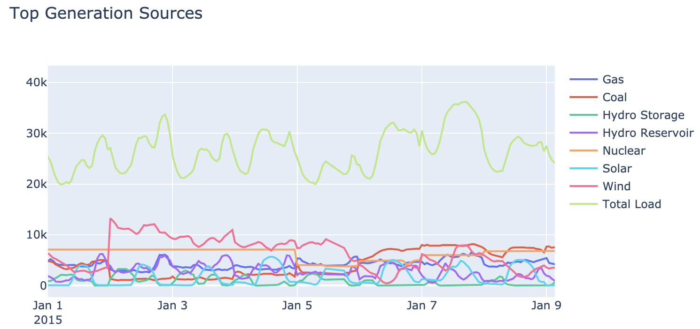
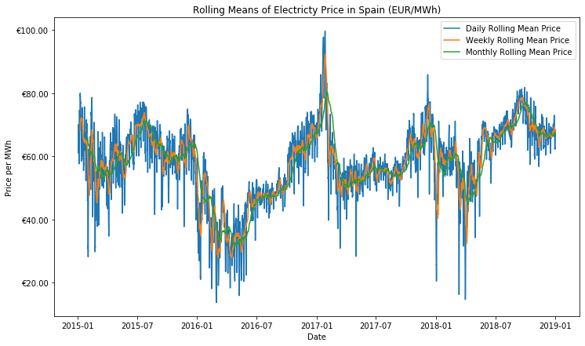
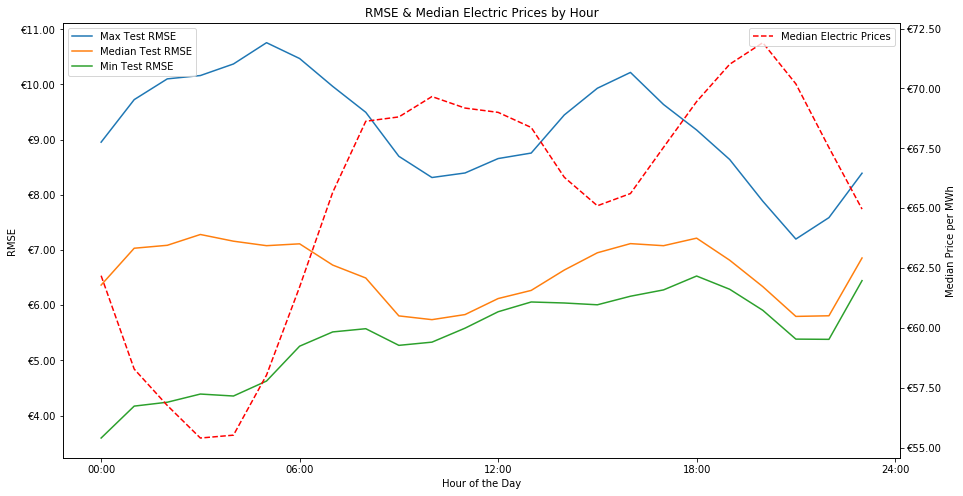
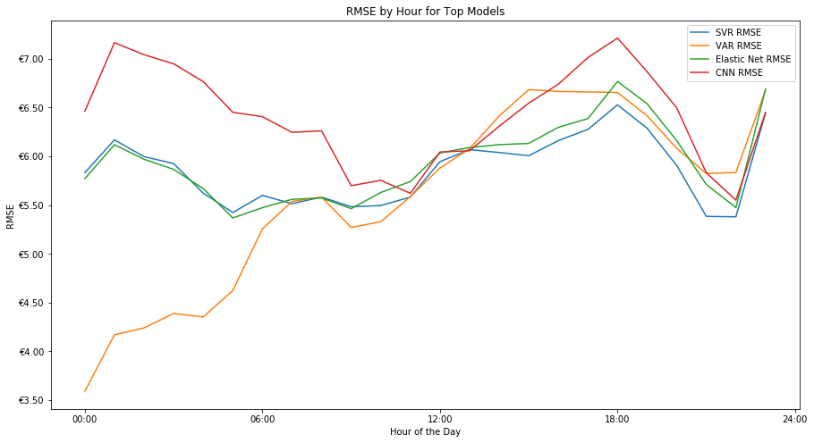

# Technical Report

Details the technical approach taken for the project including:
- [Problem Statement](#Problem-Statement)
  - Mechanics of Spanish Day Ahead Auctions
- [Cleaning & Transforming Data](#Cleaning-&-Transforming-Data)
  - Data Sources & Summary
  - Cleaning
  - Transforming
- [Modeling](#Modeling)
  - Assumptions
  - Baseline
  - Models & Tuning
  - Evaluation Metrics
- [Summary Metrics](#Summary-Metrics)
  - Evaluation Statistics
  - Predictions by Hour
- [Current Best Model](#Current-Best-Model)
- [Future Work](#Future-Work)

## Problem Statement

Predict electricity prices in Spain for each hour of the upcoming day more accurately than estimates provided by the Spanish transmission agent and operator. 

Use information available during the 2pm-3pm window the previous day during which generators in Spain submit their bids. 

**Mechanics of Spanish Day Ahead Acutions** 
The entirety of Spain operates in a single wholesale market and the TSO is [RED Electrica de Espana](https://www.ree.es/en/about-us/business-activities/electricity-business-in-Spain). 

They oversee a daily auction which concludes at 3pm local time and receive bids (electric generator declares how much power they will generate and at what price) for all 24 hours of the next day. 

For more information on the spanish electric rules see this [link](./Research/market_rules_2019_non-binding_translation.pdf).

## Cleaning & Transforming Data

**Data Sources & Summary** 
The primary data set for this project was provide on [kaggle](https://www.kaggle.com/nicholasjhana/energy-consumption-generation-prices-and-weather) by Nicholas Jhana and contains 29 columns of electricity price & generation data for all of Spain for every hour from January 1, 2014 to December 31, 2018 (35064 unique hours of data). 

Additionally Nicholas provided actual weather data for the same time period for the 5 largest cities in Spain, which was not included due to it being actual rather than forecasted data. However, I hope to include either that data or source weather predictions for future iterations.

The final data included in the is daily crude oil prices in euros, scraped from [exchangerates.org.uk](https://www.exchangerates.org.uk/commodities/OIL-EUR-history.html). This data was gathered due to supplement the generation, load and price data as fuel burning sources are often the [price setters](https://www.businessjuice.co.uk/energy-guides/what-drives-the-price-of-electricity/) in electric markets.

**Cleaning**: 
Minimal cleaning of data was required with a maximum of 19 missing data points out of 35064 for any variable used for modeling. The method used to fill any missing data was *linear interpolation*. This method was chosen due to the variable, time series nature of the data and the gaps in data being small. Thus, linear interpolation allowed us to connect the previous non-missing data point and the next non-missing data point. While this is not a perfect method and likely understates the variance of the underlying data it seemed to be superior to other potential methods and overall should not have a large effect on our results since there was very little missing data.

Plots showing the filling of missing data using linear interpolation. Note that this shows the only gap larger than 1 hour in the data and the resulting plot is quite 'believable' apart from the solar data. Additionally there were no missing data points in our variables used currently in the model, with the exception of 2 missing days of oil prices.

*Before Linear Interpolation*

*After Linear Interpolation*

**Transforming**: 
The only transformation of data performed was to get all of our X and y variables onto the same row of the data frame in order to facilitate modeling. This was accomplished using the *shift* method and resulted in each day having a single row with the following data points:
- The actual, hourly electric prices for the next day (our target)
- The projected, hourly total load and wind generation for the next day (information available from the operator)
- The actual, hourly electric prices from the begining of the previous day up to and including the 2pm-3pm time slot (known previous prices)
- The projected, hourly prices for the current day from 3pm - midnight (results of previous days bids)
- The actual crude oil price for the current day

These transformations also got rid of all of our detailed information on generation from different sources. This is because that generation is determined based on the auction (with the exception of wind and solar which produce what they produce) and thus can't be known until the auction is completed and further the day ahead actually procedes and any spikes / dips in demand occur.

Additionally, given time constraints, weather projections have not been included in the analysis as of yet, but this is a near-term area of further iteration and improvement.

## Modeling

**Assumptions** 
*Time Series* 
The primary assumption necessary for time series models is that we are modeling a stationary process ([a stochastic process whose unconditional joint probability distribution does not change when shifted in time](https://en.wikipedia.org/wiki/Stationary_process)). I tested this assumption using an ADFuller test on our target variable of electric prices. The resultant p-value was 2.75E-15, an extremely low value was sufficient for me to reject the null hypothesis of the data not being stationary and allowed for modeling directly using price, without need for differencing or another technique to generate stationarity.

*Linear Modeling Assumptions* 
For our linear models there are 5 assumptions that we need to fulfill in order to use a linear model. In this instance we were able to do so (descriptions of assumptions taken from General Assembly lesson): 
1. **Linearity:** Y must have an approximately linear relationship with X. 
 
Looking at the heatmap of our x-variables (note that this is pre-transformation) vs the target we can see that while there are no perfect linear relationships we have correlation between features and the target. 

2. **Independence of Errors:** Errors (residuals)must be independent of one another. 
 
As you can see in the scatter plot of our elastic net errors, while, there are a couple periods that seem to have larger errors we can reasonably state independence of errors.

3. **Normality:** The errors (residuals) follow a Normal distribution with mean 0. 
 
Looking at the distplot of errors for the elastic net we can see a normal distribution with mean of 0.

4. **Equality of Variances**: The errors (residuals) should have a roughly consistent pattern, regardless of the value of the X variables. 
We feel confident that this is true.

5. **Independence of Predictors:** The independent variables must be independent of one another. 
This is never completely true but is true enough for the purposes of this problem.

**Baseline & Evaluation Metrics**: 
The baseline against which we compared our models was day ahead prices provided in the original data set. These prices were not particularly accurate, generally underestimating the actual price, with a correlation of 0.73 with the actual prices and the following scores on the 2 metrics we used for evaluation:
- RMSE: €13.25
- R-Squared: 0.13

**Models & Tuning** 
The models tested fell broadly into 3 groups: standard regressors, vector auto regressors and neural nets. For all models the 4 years of data was split into 3 years of train data and 1 year of test data and the grid searches used sklearn's TimeSeriesSplit with 4 splits to determine the best model. 

Below is a summary of the various models within each group and the hyperparameters tuned for each one (tuned parameter values in parentheses).

*Standard Regressors* 
A grouping of widely used regressors found in the sklearn library
- Linear Regression
  - No tuning
- Elastic Net Regression
  - alpha: regularization strength (0.01)
  - l1 ratio: LASSO vs Ridge regularization (1)
- K Nearest Neighbors Regression
  - n neighbors: how many neighbors are considered when predicting (11)
- Random Forest
  - n estimators: number of trees created (100)
  - max depth: how deep each tree can go (None)
  - min samples leaf: fewest number of samples allowed at each leaf node (1)
  - warm start: whether to reuse the solution to the previous call to fit and add more estimators (False)
  - min_samples_split: minimum number of samples at a leaf to allow splitting further (2)
- AdaBoost
  - loss: loss function used (linear)
  - n estimators: number of estimators (100)
- Support Vector Regressor
  - C: inverse regularization strength (1)
  - kernel: kernel type used in the algorithm (linear)
  - gamma: kernel coefficient (not used with linear kernel)
  
*Vector Auto Regressors* 
A family of popular regressors that use past y variables to predict new ones simultaneously. Due to difficulties in incorporating new observations in predictions it is difficult to make a 1 to 1 comparison with other model types, a VAR model has been fit but a VARMAX including exogenous variables is still outstanding.
- VAR
  - Lags: how many time periods back we will use to predict (7)
- VARMAX 
  - *TBU*

*Neural Networks* 
Three neural networks that are common in time series analysis were fit to the data. All models used dropouts to avoid overfitting and a single hidden layer after the network specific layer(s) (i.e. convolutional layer(s) for a CNN)
- Recurrent Neural Network (RNN)
  - Optimization is yet to occur due to difficulties implementing a keras TimeSeriesGenerator with a sklearn GridSearchCV
- Convolutional Neural Network (CNN)
  - kernel size: length of 1D convlution window (15)
  - pool size: size of pooling window (2)
  - dropout: % of nodes that are dropped while fitting (0.25)
  - units: nodes in hidden layer (80)
- Long Short Term Memory (LSTM)
  - lstm layer size (103)
  - units: nodes in hidden layer (80)
  - dropout: % of nodes that are dropped while fitting (0.5)
  
## Evaluation

**Summary Metrics** 
| **Model**        | **Baseline** | **Linear Regression** | **Elastic Net** | **KNN** | **Random Forest** | **AdaBoost** | **SVR** | **VAR** | **VARMAX** | **RNN** | **CNN** | **LTSM** |
|------------------|--------------|-----------------------|-----------------|---------|-------------------|--------------|---------|---------|------------|---------|---------|----------|
| *Full Test RMSE* | €13.25       | €5.99                 | €5.96           | €7.50   | €6.94             | €7.16        | €5.87   | €5.65   | *TBU*      | *TBU*   | €6.43   | €9.25    |
| *Full Test r2*   | 0.130        | 0.759                 | 0.762           | 0.623   | 0.677             | 0.657        | 0.769   | 0.786   | *TBU*      | *TBU*   | 0.723   | 0.427    |
| *Mean Test RMSE* | *NA*         | €5.98                 | €5.94           | €7.47   | €6.89             | €7.12        | €5.86   | €5.58   | *TBU*      | €7.81   | €6.41   | €9.20    |
| *Mean Train r2*  | *NA*         | 0.844                 | 0.843           | 0.753   | 0.966             | 0.811        | 0.830   | *NA*    | *TBU*      | 0.857   | 0.779   | 0.501    |
| *Mean Test r2*   | *NA*         | 0.699                 | 0.703           | 0.543   | 0.610             | 0.579        | 0.713   | 0.730   | *TBU*      | 0.457   | 0.658   | 0.309    |

*Note*: Mean metrics are the mean value for said metrics that were originally calculated for each hour, metrics without *mean* in name were calculated on entire test data set.

From these metrics it is clear that the best 2 models are the VAR and SVR models but for future analysis it is worth looking further into the elastic net and cnn models as they also perform well and additional features / online learning may lead them to be comparable or better than our leaders. The linear regression was near identical to the elastic net but going forward we will focus on the elastic net as it is a linear regression but with tunable regularization so including both would be overkill. While the best elastic net had very little regularization it is possible that we will perform better with more as weather and other data is added to the model.

**Predictions by Hour** 
One of the peculiarities of this problem is that all 24 hours of next day prices must be predicted by the same deadline. This naturally leads to an imbalance of known data for predicting and potentially less certainty when predicting the later hours vs the early hours of the day.

In looking at the RMSE's by hour of the day we can see that this was not the case and on aggregate our models seemed to do a better job of predicting prices during times when electricity prices were highest.

When we look at our, previously identified, top 4 models we can see the interesting pattern that the VAR does very well predicting the early hours of the day before it's performance tails off, while the SVR is more steady and is the best performing later in the day.

This leads me to feel that the SVR is probably the best standalone model, despite it's worse score than the VAR, given that it's performance is more steady throughout the day. However, given the problem not requiring a particularly fast solution with the known, daily bid deadline there is no reason that we can't combine the predictions of the VAR for the first half of the day with the SVR for the second half of the day.

Further, the performance of the VAR leads me to believe that the VARMAX may perform very well once it is implemented.

## Current Best Model

The project is currently ongoing and none of the models so far perform at high enough level that I would call them production models. However, as the project currently stands our best model is a combination of the VAR and SVR models.  

By combining the predictions from the VAR for the first 12 hours of the day, when it performs best, and the SVR for the last 12 hours of the day we are able to get a clear boost in performance, as seen below:

| **Model**          | **Baseline** | **SVR** | **VAR** | **VAR-SVR** |
|--------------------|--------------|---------|---------|-------------|
| **Full Test RMSE** | €13.25       | €5.87   | €5.65   | €5.49       |
| **Full Test r2**   | 0.130        | 0.769   | 0.786   | 0.798       |

However, we are still off by a huge amount at times as seen by the distribution of errors and in order to have a truly usable model for this application further refinement will be needed.

## Future Work

There are numerous areas for future improvements to the models and project as a whole. These areas for improvement can be broadly broken down into 5 areas:
- Continued research
  - I am certainly not an expert on electric grids and factors for pricing, continued research into grids and modeling techniques will help improve predictions and analysis
- Model & feature improvements
  - Incorporate weather data & predictions
  - More information on fuel prices, futures contract pricing
  - Incorporate connected grids (Spain's grid is connected to all neighboring countries and more broadly through Europe)
  - Continued iteration and testing of hyperparameters for top models
- Online learning
  - Incorporate process so that the models are constantly learning from new data not just making predictions
  - Develop signal for when model performance slips
- Production code & app / website
  - Transform code from static jupyter notebooks to production code that can directly take information from APIs and other feeds to generate predictions
  - Show predictions in real time
- Real-time, medium-term and long-term forecasting
  - The current scope of the problem is centered around day ahead auctions but this is far from the only scenario in which electric price forecasting is useful
  
If anyone has actually read this far please let me know of any comments of suggestions!
